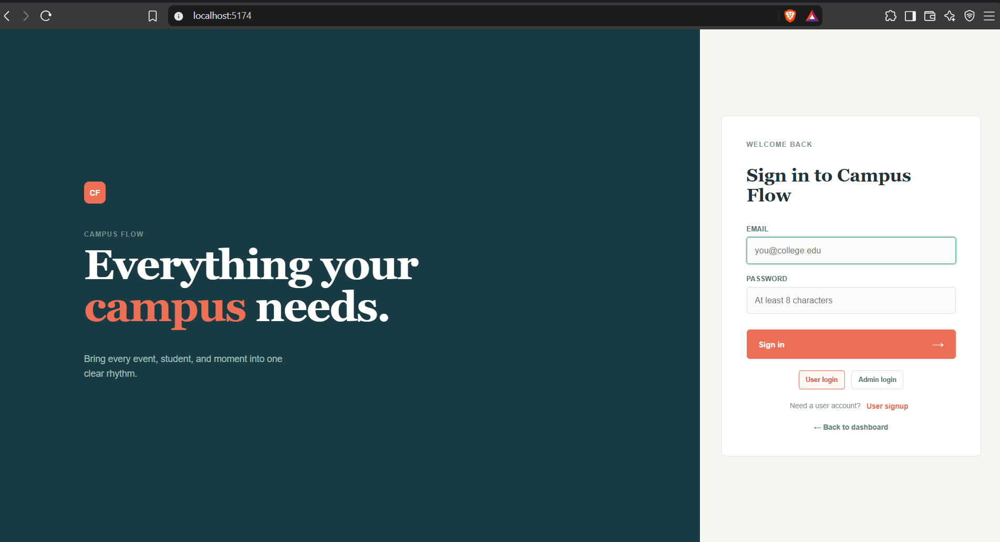
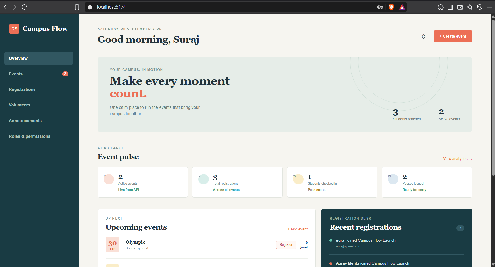
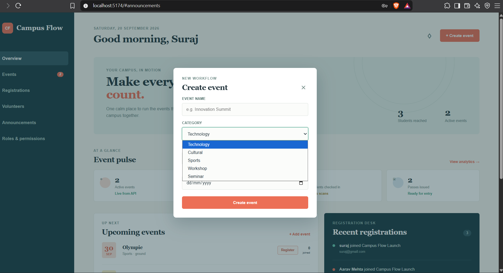
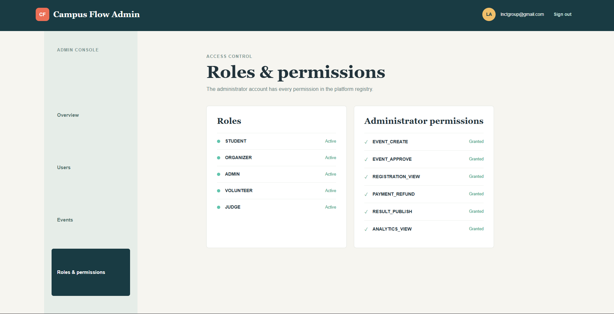
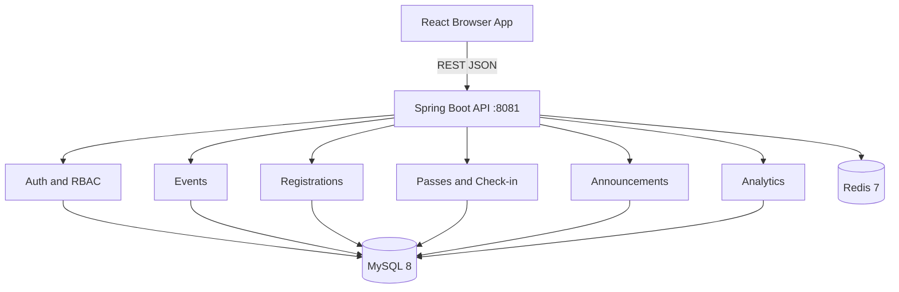
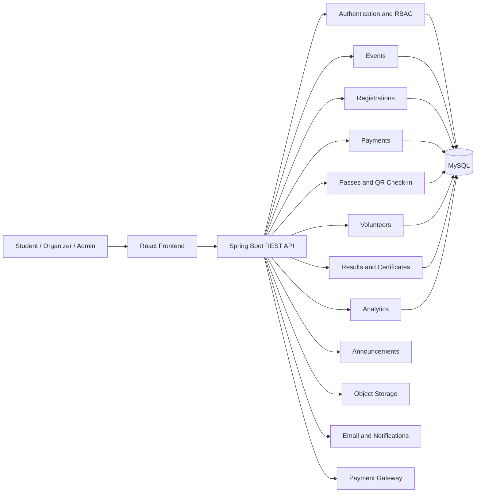

# Campus Flow

Campus Flow is a centralized college platform for managing fests, cultural events, hackathons, sports competitions, workshops, seminars, registrations, passes, volunteers, certificates, announcements, and analytics.

### Home Page



### Dashboard



### Events



### Admin



## Technology Stack

- **Frontend:** React.js with Vite
- **Backend:** Spring Boot REST API
- **Database:** MySQL
- **Authentication:** Spring Security with JWT access and refresh tokens
- **Database migrations:** Flyway
- **File storage:** Object storage for event images, documents, and certificates
- **Payments:** Payment gateway integration with server-side webhook verification
- **API documentation:** OpenAPI / Swagger
- **Testing:** JUnit, Mockito
## Implemented Application Stack

### Frontend

- React 19 with TypeScript
- Vite development server
- Responsive CSS dashboard UI
- Browser-based login, user signup, admin login, event creation, registration, pass, and announcement flows

### Backend

- Java 21
- Spring Boot 3.5.5
- Spring MVC REST controllers
- Spring Data JPA and Hibernate
- Spring Security with BCrypt password hashing
- Flyway database migrations
- Maven Wrapper for reproducible builds

### Infrastructure

- MySQL 8 for persistent data
- Redis 7 available through Docker Compose for future caching and sessions
- Local frontend server on port `5174`
- Local backend server on port `8081`

## Running the Project Locally

### Prerequisites

- Node.js and npm
- Java 21
- Docker Desktop, or a local MySQL 8 instance

### 1. Start MySQL 

From the project root:

```powershell
docker compose up -d mysql 
```

The default Docker database configuration is:

```text
Database: campus_flow
Username: campus_flow
Password: campus_flow
MySQL port: 3306
```

If using an existing local MySQL installation, update `backend/src/main/resources/application.properties` with the correct connection values.

### 2. Start the backend

```powershell
cd backend
.\mvnw.cmd spring-boot:run
```

The backend runs at:

```text
http://localhost:8081
```

Health check:

```text
http://localhost:8081/api/v1/health
```

### 3. Start the frontend

In a second terminal:

```powershell
cd frontend
npm install
npm run dev -- --host localhost
```

Open:

```text
http://localhost:5174
```

Port `5173` may be used if it is available. The frontend allows both local Vite ports for development API requests.

### 4. Build and validate

Frontend production build:

```powershell
cd frontend
npm run build
```

Backend package build:

```powershell
cd backend
.\mvnw.cmd -DskipTests package
```

## Current Features

### Authentication and Access

- User signup with first name, last name, email, and password
- User login with BCrypt password verification
- Separate User signup, User login, and Admin login options
- Seeded administrator account configured through `campus.flow.admin.email` and `campus.flow.admin.password`
- Role and permission registry
- Admin access to all registered permissions

### Event Management

- Create events with title, category, venue, and date
- Upcoming event dashboard
- Event categories and event status
- Event registration counts
- Flyway-managed event schema

### Student Registration

- Register a student for an event
- Email validation
- Duplicate registration prevention per event
- Recent registrations panel for organizers
- Registration count analytics

### Event Passes and Check-in

- Unique pass token generated for registrations
- Pass confirmation after registration
- Check-in endpoint for event staff
- Duplicate check-in protection

### Announcements and Analytics

- Create and list announcements
- Audience selection for announcements
- Live event, registration, pass, and check-in metrics
- Admin overview, user management, event administration, and access-control views

## Application Architecture

Campus Flow uses a modular monolith architecture. The backend is deployed as one Spring Boot application, but each business capability has its own package and database boundary. This keeps local development straightforward while preserving clear ownership for future service extraction.



### Backend Modules

```text
backend/src/main/java/com/campusflow/
├── auth/          users, login, signup, roles, permissions
├── event/         event entity, repository, and event API
├── registration/  student registrations and validation
├── pass/          event passes and check-in
├── announcement/ announcements and audience targeting
├── analytics/     dashboard overview metrics
└── common/        security, CORS, health, and shared configuration
```

### Frontend Areas

```text
frontend/src/
├── App.tsx        dashboard, auth, student, organizer, and admin views
├── App.css        responsive application styling
├── index.css      global typography and page defaults
└── main.tsx       React application entry point
```

## Database Schema

Flyway migrations are stored in `backend/src/main/resources/db/migration` and currently include:

```text
V1__create_events.sql
V2__create_registrations.sql
V3__create_event_passes.sql
V4__create_announcements.sql
V5__create_core_platform_tables.sql
```

### Implemented Tables

```text
events
registrations
event_passes
announcements
users
roles
permissions
user_roles
role_permissions
event_categories
student_profiles
event_organizers
event_schedules
event_venues
event_documents
registration_forms
registration_form_fields
registration_answers
teams
team_members
waitlist_entries
```

### Important Relationships

```text
User M---M Role through user_roles
Role M---M Permission through role_permissions
User 1---1 StudentProfile
Event 1---M Registration
Registration 1---1 EventPass
Event 1---M Announcement through the announcement API
Event 1---M EventSchedule
Event 1---M Team
Team M---M User through team_members
Event M---M User through event_organizers
Event 1---1 RegistrationForm
RegistrationForm 1---M RegistrationFormField
Registration 1---M RegistrationAnswer
Event 1---M WaitlistEntry
```

### Data Rules

- User emails are unique and stored case-insensitively by application validation.
- Event and student email combinations are unique for registrations.
- Each registration has at most one event pass.
- Pass tokens are unique and check-in timestamps prevent duplicate check-ins.
- Role names and permission names are unique.
- Team names are unique within an event.
- Waitlist positions are unique within an event.
- Schema changes must be added as a new Flyway migration; existing migrations should not be edited after being applied.

## Roles and Permissions

### Roles

| Role | Responsibility |
| --- | --- |
| `STUDENT` | Browse events, register, receive passes, and view participation information. |
| `ORGANIZER` | Create events, manage registrations, publish announcements, and monitor activity. |
| `ADMIN` | Full platform administration, role management, event administration, and analytics. |
| `VOLUNTEER` | View assigned event tasks, shifts, and attendance responsibilities. |
| `JUDGE` | Review assigned competitions and submit scores. |

### Permissions

| Permission | Description |
| --- | --- |
| `EVENT_CREATE` | Create and edit events. |
| `EVENT_APPROVE` | Approve or reject events for publishing. |
| `REGISTRATION_VIEW` | View event registrations and attendee details. |
| `PAYMENT_REFUND` | Process payment refunds. |
| `RESULT_PUBLISH` | Publish event results and certificates. |
| `ANALYTICS_VIEW` | View platform and event analytics. |

The seeded administrator account is granted all permissions. Public signup always creates a `STUDENT` account; administrator accounts are not created through public signup.

## Key API Endpoints

```text
POST /api/v1/auth/register
POST /api/v1/auth/login
GET  /api/v1/auth/roles

GET  /api/v1/events
POST /api/v1/events

GET  /api/v1/registrations
POST /api/v1/events/{eventId}/registrations
GET  /api/v1/registrations/{registrationId}/pass
POST /api/v1/checkins

GET  /api/v1/announcements
POST /api/v1/announcements
GET  /api/v1/analytics/overview
GET  /api/v1/health
```

## Architecture

Campus Flow will begin as a **modular monolith**. The backend will be one Spring Boot application, but each business area will have a clear module boundary. This keeps the first version simple to deploy while allowing individual modules to become services later if the platform needs to scale.



## User Roles

- **Student:** Browse events, register, pay, download passes, check attendance, and download certificates.
- **Event Organizer:** Create events, manage registrations, assign volunteers, publish announcements, and manage results.
- **College Admin:** Approve events, manage users and permissions, configure categories, and view platform-wide analytics.
- **Volunteer:** View assigned tasks and shifts, update task status, and record attendance.
- **Judge:** View assigned competitions and submit scores.
- **Finance Staff:** Review payments, process refunds, and generate payment reports.

Access will use role-based permissions such as `EVENT_CREATE`, `EVENT_APPROVE`, `PAYMENT_REFUND`, `RESULT_PUBLISH`, and `ANALYTICS_VIEW`.

## Backend Modules

### Authentication and Users

- Login, registration, password reset, and email verification
- Student and staff profiles
- JWT access and refresh tokens
- Roles and permissions
- Session and account security

### Events

- Fests, cultural events, hackathons, sports, workshops, and seminars
- Event categories, tags, images, documents, venues, and schedules
- Capacity, eligibility rules, registration dates, and event dates
- Draft, pending approval, published, ongoing, completed, and cancelled states
- Admin approval workflow
- Individual and team events

### Registrations

- Student and team registration
- Custom registration forms and fields
- Registration approval, rejection, cancellation, and waitlists
- Attendance status
- Registration confirmation and history

### Payments

- Free and paid event registration
- Payment order creation
- Payment gateway integration
- Webhook verification
- Receipts, refunds, and payment reports
- Idempotent payment processing

The frontend payment result will never be trusted by itself. The backend will confirm payment using the gateway webhook or server-side verification.

### Passes and Check-in

- Unique event passes
- QR code generation
- QR scanning at entry
- Duplicate check-in prevention
- Registration and payment validation
- Attendance records

### Volunteers

- Volunteer applications
- Organizer approval
- Task and shift assignment
- Volunteer attendance
- Volunteer performance records
- Volunteer certificates

### Results and Certificates

- Judge assignment
- Scoring criteria
- Score submission and review
- Ranking calculation
- Result publishing
- Certificate generation
- Public certificate verification codes

### Announcements and Notifications

- Event-specific announcements
- College-wide announcements
- Email notifications
- In-app notifications
- Scheduled announcements

### Analytics

- Registration counts
- Revenue and payment success rates
- Attendance
- Event popularity
- Category-wise participation
- Volunteer participation
- Registration conversion

Initial analytics can use MySQL reporting queries. Redis, a reporting database, or a data warehouse can be added when traffic requires it.

